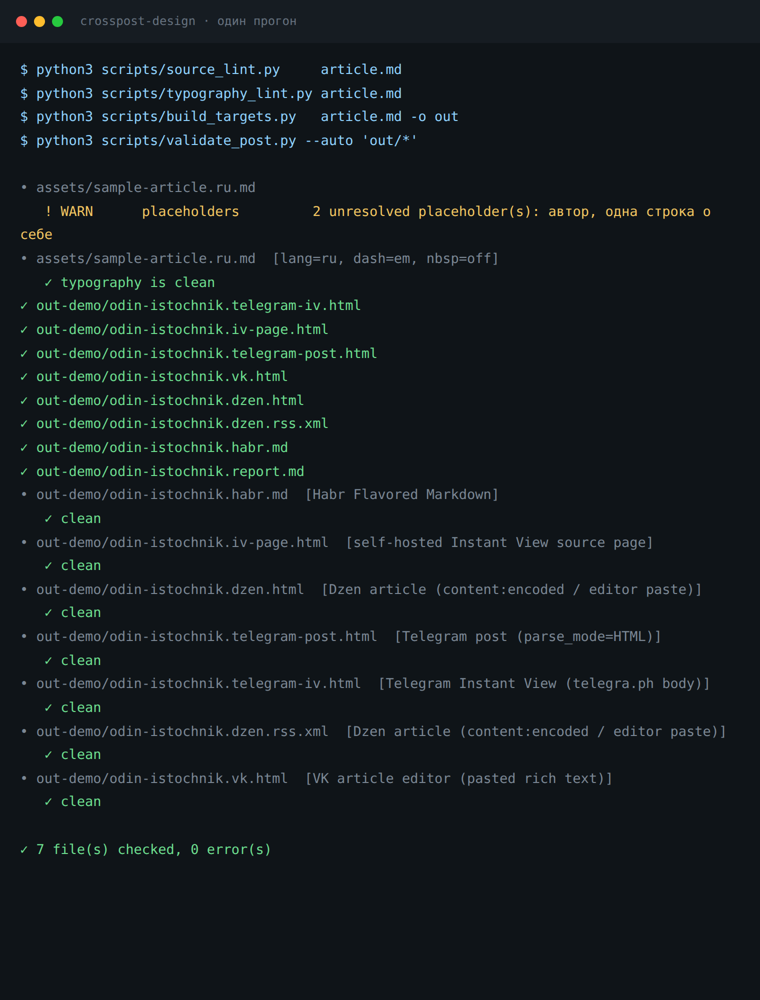
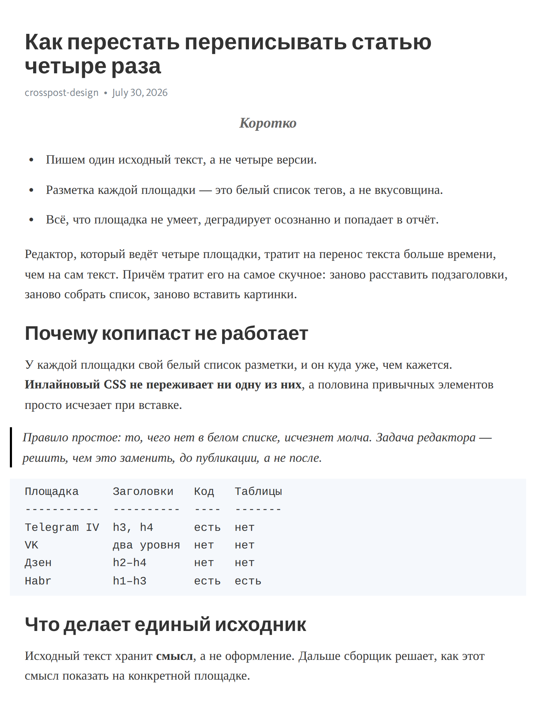
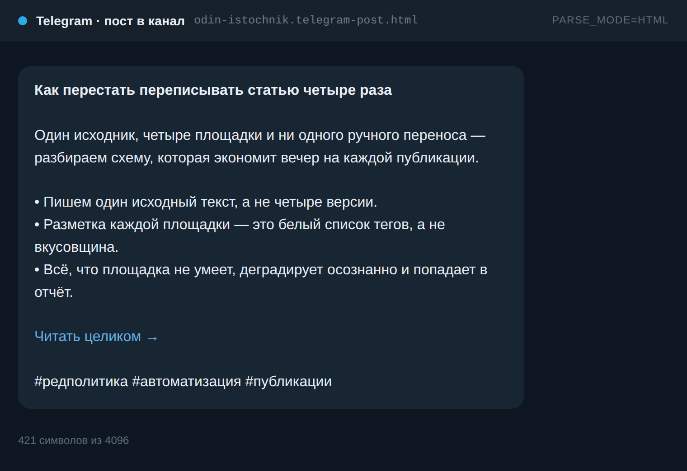
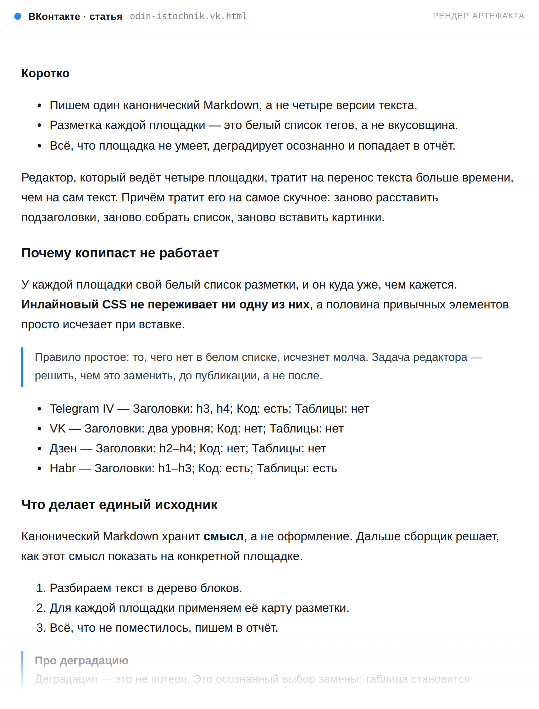
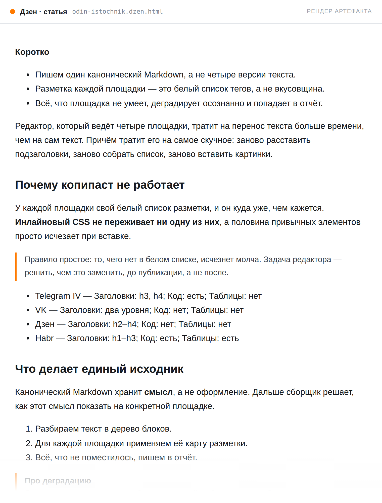
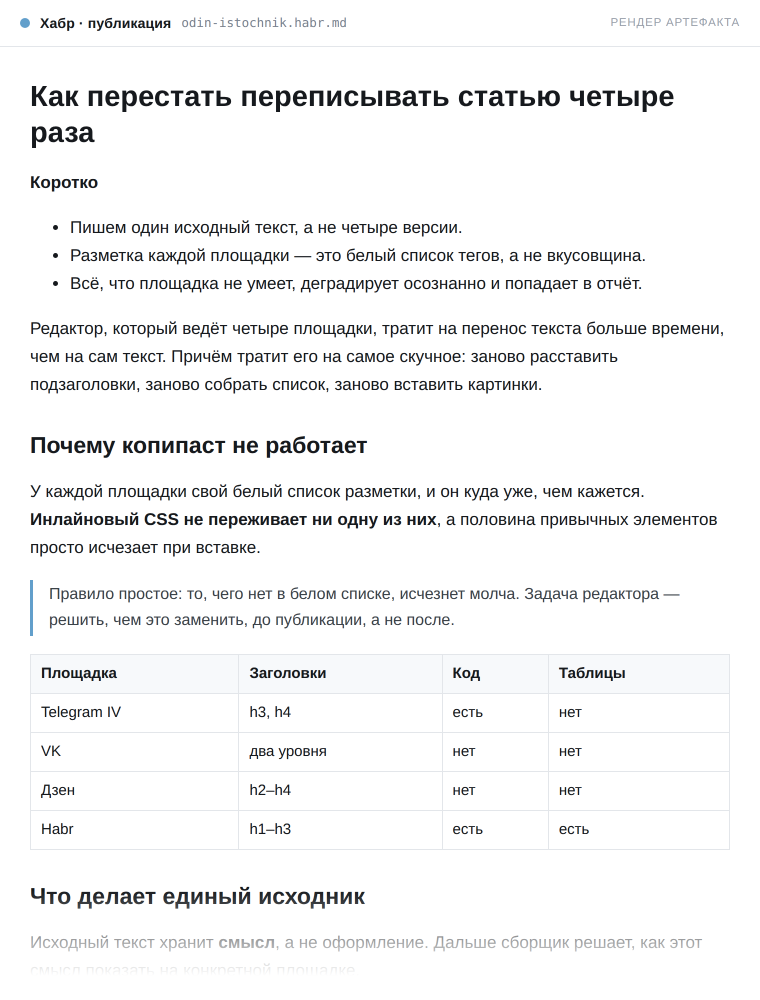
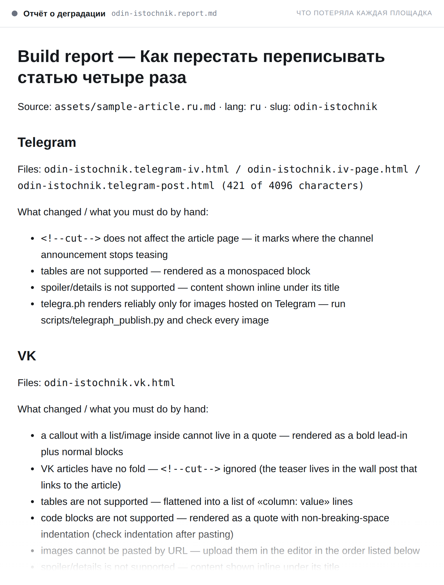

# crosspost-design · Telegram IV · ВКонтакте · Дзен · Хабр

**Один канонический Markdown → четыре опубликованные статьи, на русском или английском.**

Скилл для агента (Claude Code / Codex / Cursor …), который верстает статью под
Telegram Instant View, ВК, Дзен и Хабр — площадки, каждая из которых вырезает
CSS и принимает свой короткий белый список разметки. Скилл детерминированно
собирает все цели, применяет типографику нужного языка и показывает, что именно
каждая площадка потеряла.

Русский · [English](README.en.md)

Адаптация [gzh-design-skill](https://github.com/isjiamu/gzh-design-skill)
(WeChat / 公众号, китайский). AGPL-3.0 — что сохранено, переработано и заменено,
описано в [NOTICE](NOTICE).

---

## Один прогон

Проверка исходника → сборка → проверка соответствия. Ноль ERROR означает «можно
публиковать».



## Исходная посылка

WeChat разрешает произвольный инлайновый CSS — поэтому там имеет смысл возить с
собой цветовые темы. **Telegram, ВК, Дзен и Хабр — нет.** Каждая площадка
удаляет `style`, `class`, шрифты и цвета при импорте. Остаются структура и
Unicode.

Поэтому «оформление» здесь — это:

- **структура**: ритм разделов, лид, который работает как сниппет в ленте,
  блок «Коротко», врезки, один жирный акцент на раздел;
- **типографика**: «ёлочки», настоящие тире, многоточие, неразрывные пробелы —
  они выживают, потому что это символы, а не стили;
- **честная деградация**: таблица становится моноширинным блоком в telegra.ph и
  списком во ВК, и вы узнаёте об этом до публикации, а не после.

## Как это выглядит

Ниже — одна и та же статья, собранная под четыре площадки. Смотреть надо не на
красоту, а на различия: где таблица осталась таблицей, а где схлопнулась в
список; где код остался кодом, а где стал цитатой.

### Telegram Instant View — живая страница

Единственный настоящий скриншот: страницу опубликовал сам скилл командой
`telegraph_publish.py`, у telegra.ph Instant View работает из коробки.

**[Открыть демо →](https://telegra.ph/Kak-perestat-perepisyvat-statyu-chetyre-raza-07-30)**
(вставьте ссылку в любой чат Telegram — появится кнопка Instant View)



Видно ограничения telegra.ph: заголовки только `h3`/`h4`, таблиц нет вообще —
таблица из исходника стала выровненным моноширинным блоком, а `:::tldr`
превратился в `<aside>`.

### Пост в канал



Отдельный артефакт: у сообщений Telegram нет блочных тегов вообще, структура
держится на переводах строк. Буллиты берутся из `:::tldr`, ссылка «Читать
целиком» — из опубликованной страницы, счётчик символов проверяется валидатором.

### ВКонтакте и Дзен — там, где больнее всего

<table>
<tr>
<td width="50%"></td>
<td width="50%"></td>
</tr>
<tr>
<td><b>ВКонтакте.</b> Таблица схлопнулась в список «первая ячейка — колонка:
значение». Кода нет как класса — блок кода стал цитатой с неразрывными
пробелами вместо отступов. Картинки не вставляются вообще: на их месте
нумерованные заглушки и список загрузки в отчёте.</td>
<td><b>Дзен.</b> Заголовки <code>h2</code>/<code>h3</code>, таблица так же
схлопнута. Главная ловушка площадки — форматирование внутри пунктов списка не
рендерится вообще, поэтому сборщик его снимает сам и пишет об этом в отчёт.</td>
</tr>
</table>

### Хабр — единственная площадка, где ничего не теряется



Та же таблица осталась таблицей, код — кодом с указанием языка, спойлер —
настоящим `<spoiler>`. Если в материале есть код, таблицы или формулы, Хабр
должен быть первой целью, а не последней.

### Отчёт о деградации



Главная страховка от «вставил и не заметил». По каждой площадке: какие файлы
собраны, что деградировало и что придётся сделать руками — например, в каком
порядке загружать картинки во ВК.

> **Честно про эти картинки.** Настоящий скриншот здесь один — страница
> telegra.ph, потому что её публикует сам скилл. Для ВК, Дзена и Хабра
> интерфейсы недоступны без аккаунта, поэтому показан **рендер реально собранных
> артефактов** в нейтральной читалке: содержимое и ограничения настоящие,
> оформление площадок не имитируется. Пересобрать всё:
> `node docs/make-screenshots.mjs out docs/screenshots`.

## Что получается на выходе

| Цель | Файл | Как публиковать |
|---|---|---|
| Telegram Instant View | `{slug}.telegram-iv.html` | `telegraph_publish.py` → ссылка с готовым IV |
| Instant View на своём сайте | `{slug}.iv-page.html` | хостите страницу + шаблон правил из `assets/` |
| Анонс в канал | `{slug}.telegram-post.html` | `parse_mode=HTML`, до 4096 символов |
| Статья ВК | `{slug}.vk.html` | страница предпросмотра → «Копировать» → вставка |
| Дзен | `{slug}.dzen.html`, `{slug}.dzen.rss.xml` | вставка в редактор или RSS |
| Хабр | `{slug}.habr.md` | вставка в режиме Markdown |
| Отчёт о деградации | `{slug}.report.md` | что потерялось и что делать руками |

## Быстрый старт

```bash
# 1. проверить исходник: структура, потом типографика
python3 scripts/source_lint.py     assets/sample-article.ru.md
python3 scripts/typography_lint.py assets/sample-article.ru.md --fix

# 2. собрать все цели
python3 scripts/build_targets.py   assets/sample-article.ru.md -o out

# 3. проверить соответствие — ноль ERROR означает «готово»
python3 scripts/validate_post.py --auto 'out/*'

# 4. опубликовать страницу IV и пересобрать анонс со ссылкой
python3 scripts/telegraph_publish.py out/odin-istochnik.telegram-iv.html \
        --title "…" --author "…"
python3 scripts/build_targets.py assets/sample-article.ru.md -o out \
        -p telegram --iv-url https://telegra.ph/…

# 5. получить страницу с кнопкой «Копировать» для ВК / Дзена
python3 scripts/wrap_preview.py out/odin-istochnik.vk.html
```

Только стандартная библиотека Python 3. Никаких зависимостей и сети, кроме
`telegraph_publish.py`. (Playwright нужен исключительно для пересъёмки картинок
к этому README и в работе скилла не участвует.)

## Канонический исходник

```markdown
---
title: Как перестать переписывать статью четыре раза
lang: ru
lede: Одно предложение, которое должно работать как сниппет в ленте.
author: {{автор}}
tags: [а, б]
canonical: https://…
---

:::tldr
- три настоящих вывода
:::

вступительные абзацы
<!--cut-->

## Раздел

> [!NOTE] Врезка
> Вынесена из абзаца, в telegra.ph рендерится как <aside>.

:::spoiler Длинные логи
Сворачивается на Хабре, на остальных площадках видна целиком.
:::

| не больше 3 колонок | чтобы пережить схлопывание |
| --- | --- |
```

Полный справочник элементов и того, во что каждый превращается на каждой
площадке: [references/common-components.md](references/common-components.md).
Живой пример со всеми элементами — [assets/sample-article.ru.md](assets/sample-article.ru.md).

## Состав

```
SKILL.md                        рабочий процесс, по которому идёт агент
references/
  platform-index.md             единый источник правды: что принимает каждая площадка
  platform-telegram.md          узлы telegra.ph, шаблоны IV, HTML Bot API
  platform-vk.md                редактор только для вставки, порядок загрузки картинок
  platform-dzen.md              белый список content:encoded, требования к RSS
  platform-habr.md              Habr Flavored Markdown, спойлеры, якоря, формулы
  typography-ru.md              «ёлочки», тире, неразрывные пробелы
  typography-en.md              curly quotes, em/en dash, ellipsis
  structure-recipes.md          тип статьи → скелет; пять профилей голоса
  common-components.md          каноническая разметка → рендеринг по площадкам
  format-normalize.md           docx / pdf / текст / rich text → Markdown
  eval-cases.md                 регрессионные кейсы
scripts/
  build_targets.py              парсер + пять рендереров + отчёт о деградации
  source_lint.py                проверка исходника до сборки
  consistency_check.py          сверка скилла с его справочниками
  selftest.sh                   сквозная самопроверка (24 проверки)
  typography_lint.py            типографика RU/EN, с --fix
  validate_post.py              соответствие разметки каждой площадке
  telegraph_publish.py          публикация в telegra.ph (IV из коробки)
  wrap_preview.py               страница с кнопкой «Копировать»
  extract_docx.py               .docx → Markdown, без зависимостей
assets/
  sample-article.ru.md          русский пример со всеми элементами
  sample-article.en.md          английский пример
  preview-template.html         оболочка предпросмотра
  instant-view-template.txt     стартовые правила IV для своей страницы
docs/
  make-screenshots.mjs          пересъёмка картинок для README
  render-md.py                  рендер .md в HTML тем же парсером
```

## Установка

Репозиторий одновременно и плагин, и маркетплейс: `.claude-plugin/plugin.json`
описывает сам скилл, `.claude-plugin/marketplace.json` — каталог из одного
плагина. Поэтому отдельный установщик не нужен.

**Claude Code:**

```
/plugin marketplace add Shadowru/crosspost-design-skill
/plugin install crosspost-design@crosspost-design
```

Дальше `/reload-plugins` — и скилл доступен в текущей сессии.

> [!NOTE]
> Обновления: `/plugin marketplace update crosspost-design`. Если новая версия
> не подхватилась, почистите кэш и поставьте заново:
> ```
> rm -rf ~/.claude/plugins/cache/crosspost-design ~/.claude/plugins/marketplaces/crosspost-design
> /plugin marketplace add Shadowru/crosspost-design-skill
> /plugin install crosspost-design@crosspost-design
> ```

**Claude Code, без маркетплейса:**

Скилл — это каталог с `SKILL.md` в корне, поэтому достаточно положить его туда,
где агент ищет скиллы. Благодаря `.claude-plugin/plugin.json` он подхватится сам
со следующей сессии.

```bash
git clone https://github.com/Shadowru/crosspost-design-skill.git
mkdir -p ~/.claude/skills
ln -sfn "$(pwd)/crosspost-design-skill" ~/.claude/skills/crosspost-design
```

Для одного проекта — то же самое в `.claude/skills/crosspost-design`.

> [!WARNING]
> Не ставьте обоими способами сразу. Копия из маркетплейса имеет приоритет, и
> симлинк молча не загрузится — `claude plugin list` покажет
> «name is already taken». Выберите один путь.

<details>
<summary><strong>Другие агенты</strong></summary>

Раскладка обычная: один скилл, `SKILL.md` в корне, рядом `references/`,
`scripts/` и `assets/`. Любой агент, который читает скиллы из каталога,
подхватит его симлинком — меняется только путь.

**OpenAI Codex:**

```bash
git clone https://github.com/Shadowru/crosspost-design-skill.git
mkdir -p ~/.codex/skills
ln -sfn "$(pwd)/crosspost-design-skill" ~/.codex/skills/crosspost-design
```

**Windows PowerShell:**

```powershell
git clone https://github.com/Shadowru/crosspost-design-skill.git
New-Item -ItemType Directory -Force "$HOME\.claude\skills" | Out-Null
New-Item -ItemType SymbolicLink -Path "$HOME\.claude\skills\crosspost-design" `
         -Target "$(Get-Location)\crosspost-design-skill" -Force | Out-Null
```

Симлинки в Windows требуют режима разработчика или прав администратора.

Проверено на этой машине только для Claude Code — остальные пути следуют
конвенции соответствующего агента. Если у вас не подхватилось, скажите, поправим.

</details>

Проверить, что установка живая:

```bash
scripts/selftest.sh    # 27 проверок: оба примера собираются, гейты срабатывают
```

Скрипты — чистый Python 3 без единой зависимости. Ни pip, ни Docker, ни Node
для работы скилла не нужны (Playwright — только чтобы пересобрать картинки к
этому README).

Дальше достаточно попросить — формулировка любая, скилл срабатывает на смысл:

> «Сверстай эту статью под Дзен, ВК и Хабр»
> «Подготовь текст для Хабра и Telegram»
> «Сделай Instant View и анонс в канал»

## Откуда взяты факты о площадках

Белые списки в `references/` сверены с telegra.ph/api,
instantview.telegram.org/docs, core.telegram.org/bots/api,
habr.com/ru/docs/help/markdown/, habr.com/ru/docs/help/wysiwyg/ и
dzen.ru/help/ru/website/rss-modify.html. Площадки меняются: после обновлений
перепроверяйте и правьте сначала файл в `references/` — скрипты опираются на те
же факты.

## Лицензия

AGPL-3.0, унаследована от исходного проекта. См. [LICENSE](LICENSE) и
[NOTICE](NOTICE).
